# School Management Website & Portal

A web platform developed for a private school to manage admissions, communication, assignments, and day-to-day interactions between students, teachers, and administrators.

> **Note:** This repository contains screenshots and documentation only. Source code is not included.

## Technologies Used

* PHP
* MySQL
* JavaScript
* React
* HTML
* CSS

## Features

### Public Website

* Dynamic home page with school information, events and announcements
* Multi-step admissions form with progress tracking and backend validation
* Inquiry and contact management system
* Dedicated pages for the school's vision, history and achievements

### School Portal

A role-based portal designed to provide a unified digital environment for students, teachers and administrators.

#### Interactive Feed

The portal revolves around a feed where users can access and interact with:

* Assignments
* Announcements
* School events
* Attached files and educational resources

Students can:

* Like and comment on posts
* Save posts for later reference
* Filter and search posts by category
* Submit assignments electronically before deadlines

Teachers can:

* Create assignments with due dates
* Upload supporting materials
* Publish announcements and events
* Track student engagement through comments and reactions

Administrators can:

* Manage student and teacher accounts
* Assign teachers to classes and subjects
* Review admission requests and inquiries submitted through the public website
* Edit user profiles
* Access an immutable activity log recording administrative actions

## Screenshots

> **Note:** The screenshots below originate from the project's original freelance portfolio listing and are included here for reference.

### Public Website

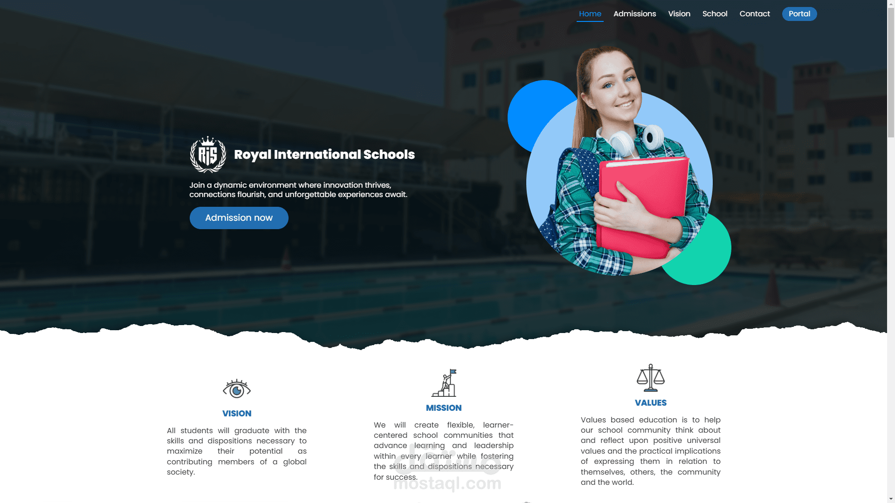

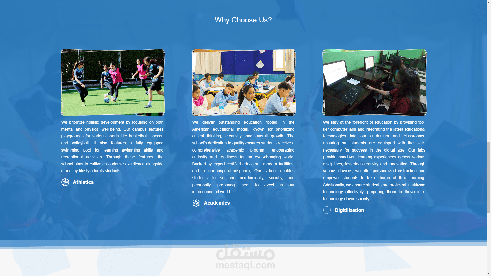

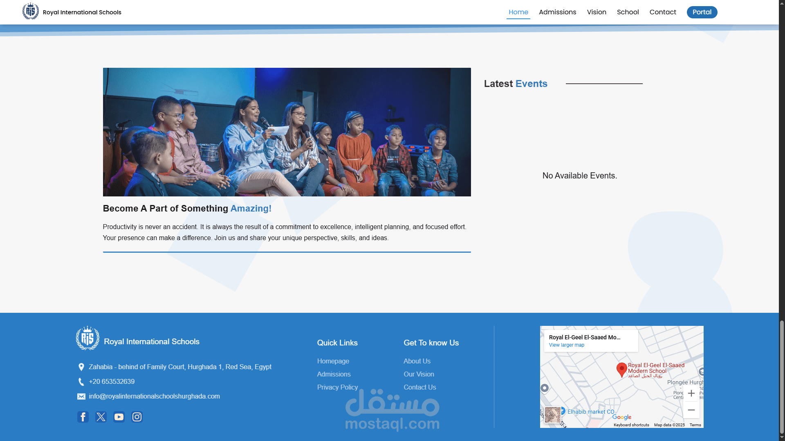

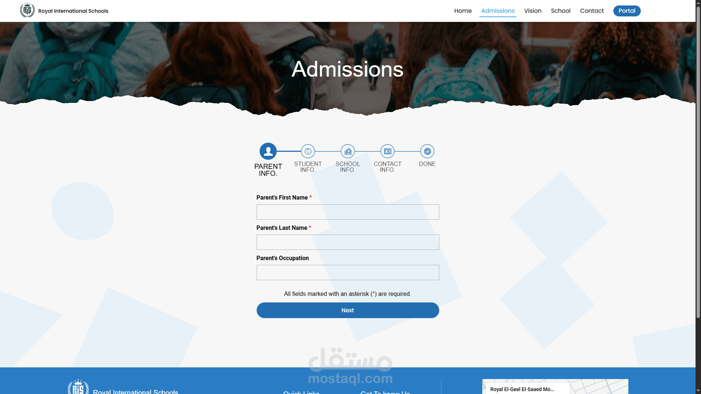

### School Portal

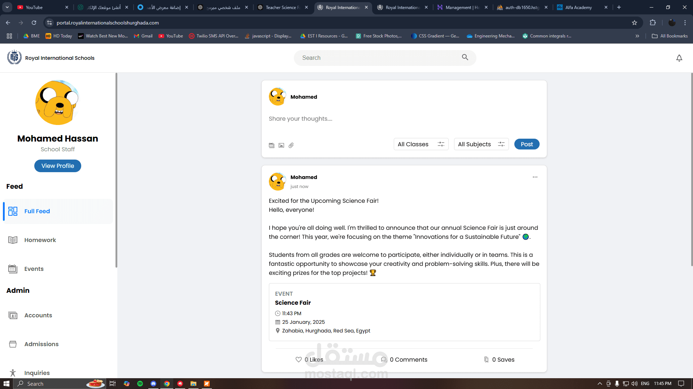

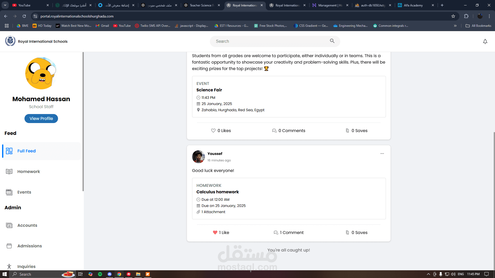

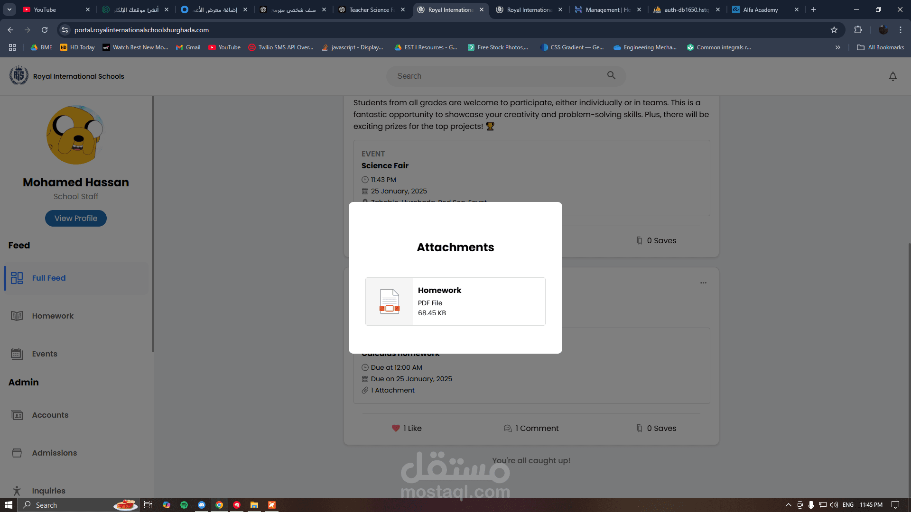

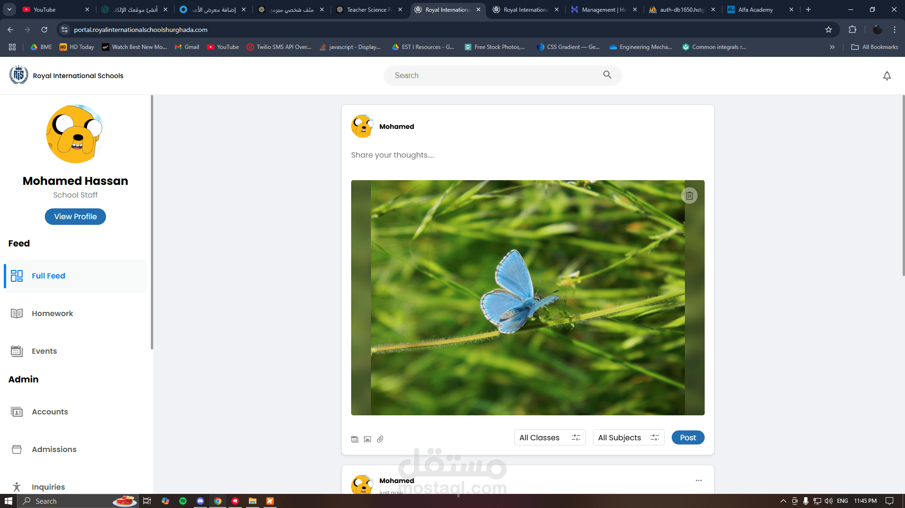

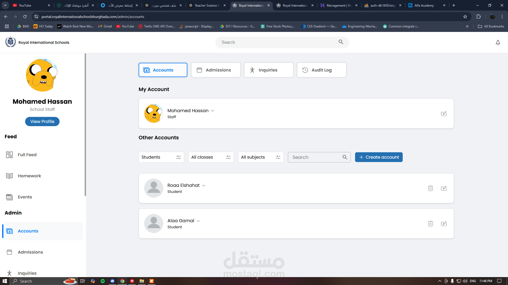

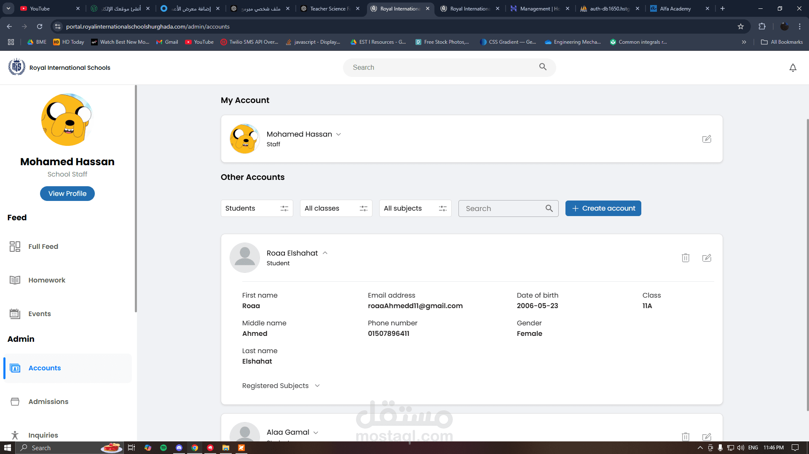

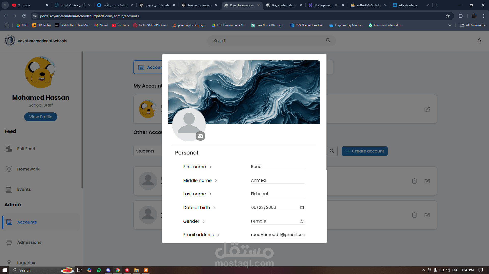

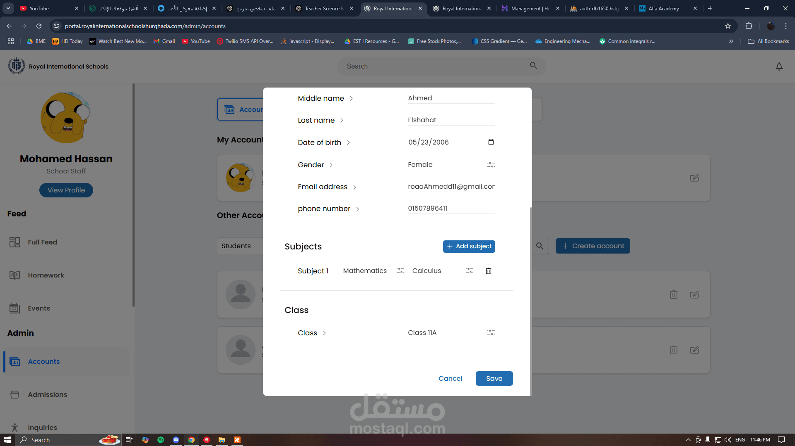

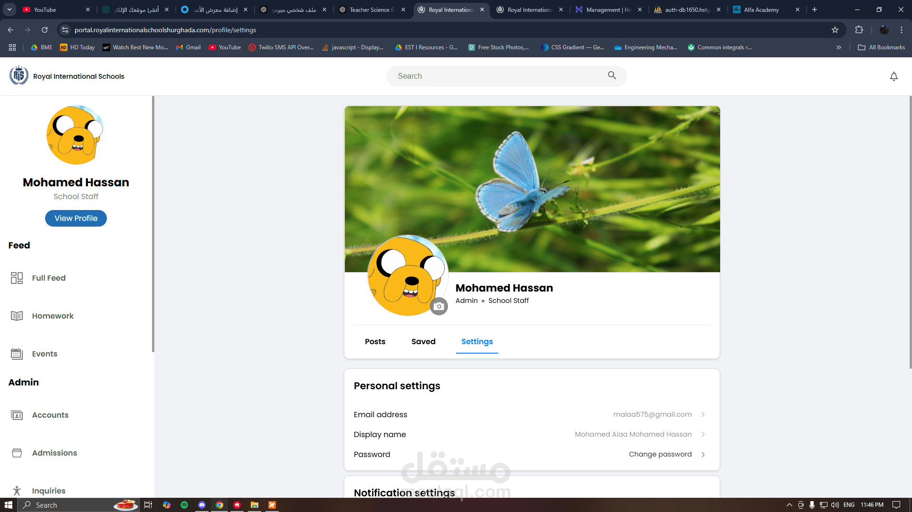

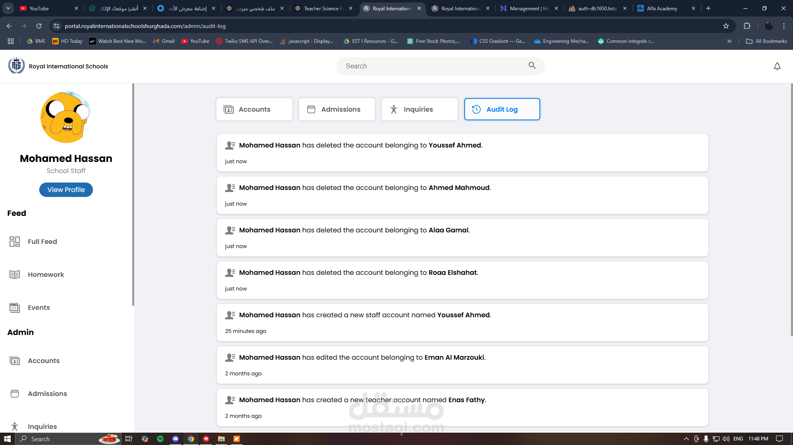
